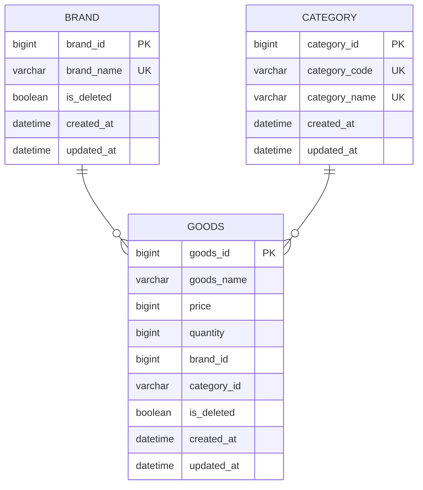

# ER Diagram

<br/>


# Description
### 1. 엔티티 개요
테이블명: BRAND (브랜드 정보 저장)
- brand_id(PK): 브랜드 고유 식별자
- brand_name(UK): 브랜드 명 (중복 방지를 위한 유니크 제약)
- is_deleted: 삭제 여부 (true/false)
  - 브랜드가 삭제된 경우 true, 그렇지 않은 경우 false
  - 브랜드가 삭제된 경우에도 브랜드 정보는 유지되며, is_deleted 컬럼을 통해 삭제 여부를 확인할 수 있습니다.
- created_at: 생성일시
- updated_at: 수정일시
<br/><br/>

테이블명: CATEGORY (카테고리 정보 저장) 
- category_id(PK): 내부 식별용 자동 증가 정수
- category_code(UK): 카테고리 코드 (예: 001)
- category_name(UK): 카테고리 명 (상의, 아우터 등)
- created_at: 생성일시
- updated_at: 수정일시
<br/><br/>

테이블명: GOODS (상품 정보 저장)
- goods_id(PK): 상품 고유 식별자
- goods_name: 상품 명
- price: 상품 가격
- quantity: 상품 수량
- brand_id: BRAND.brand_id
- category_id: CATEGORY.category_id 참조
- is_deleted: 삭제 여부 (true/false)
  - 상품이 삭제된 경우 true, 그렇지 않은 경우 false
  - 상품이 삭제된 경우에도 상품 정보는 유지되며, is_deleted 컬럼을 통해 삭제 여부를 확인할 수 있습니다.
- created_at: 생성일시
- updated_at: 수정일시
<br/><br/>

### 2. 엔티티 관계
브랜드와 상품 (1 대 N 관계)
- 하나의 브랜드는 여러 상품을 가질 수 있습니다.
<br/><br/>

카테고리와 상품 (1 대 N 관계)
- 하나의 카테고리는 여러 상품을 포함할 수 있습니다.
<br/><br/>

### 3. 설계 고려사항
유니크 제약 조건
- 브랜드 이름, 카테고리 이름/코드에 유니크 제약 조건을 설정하여 같은 브랜드 이름, 카테고리 이름이 중복되지 않도록 했습니다.
<br/><br/>

외래키 설정 제외
- 상품 테이블에서 브랜드와 카테고리의 외래키 제약 조건을 설정하지 않았습니다. 외래키 제약 조건을 설정할 경우, 예상치 못한 데드락 현상이 발생할 수 있고, 성능 저하가 발생할 수 있다고 판단했습니다.
  <br/><br/>

# DDL
```sql
-- 카테고리 테이블
create table category
(
    category_id   bigint auto_increment comment '카테고리 pk'
        primary key,
    category_code varchar(10) not null comment '카테고리 식별 코드 (ex. 001)',
    category_name varchar(50) not null comment '카테고리 명',
    created_at    datetime    not null comment '생성일시',
    updated_at    datetime    null comment '수정일시',
    constraint category_category_code_uindex
        unique (category_code),
    constraint category_name_uindex
        unique (category_name)
)
    comment '상품 카테고리';

-- 브랜드 테이블
create table brand
(
    brand_id   bigint auto_increment comment '브랜드 pk'
        primary key,
    brand_name varchar(100) not null comment '브랜드 명',
    is_deleted boolean      not null comment '삭제 여부',
    created_at datetime     not null comment '생성일시',
    updated_at datetime     null comment '수정일시',
    constraint brand_name_uindex
        unique (brand_name)
)
    comment '브랜드';

-- 상품 테이블
create table goods
(
    goods_id    bigint auto_increment comment '상품 pk'
        primary key,
    goods_name  varchar(200)   not null comment '상품 명',
    price       bigint         not null comment '상품 가격',
    quantity    bigint         not null comment '상품 수량',
    brand_id    bigint         not null comment '브랜드 pk',
    category_id bigint         not null comment '카테고리 pk',
    is_deleted  boolean        not null comment '삭제 여부',
    created_at  datetime       not null comment '생성일시',
    updated_at  datetime       null comment '수정일시'
)
    comment '상품';
```